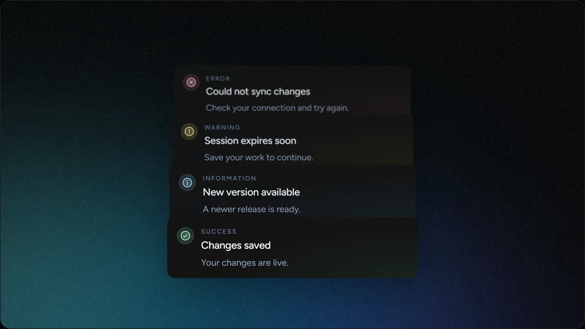

  <h1>Toast</h1>
  
A modern, layered toast system for React.

  

  

    
    
    
  

  

    <a href="https://github.com/th11n/toast">Repository</a>
    ·
    <a href="https://toast.dominikkrakowiak.com">Live preview</a>
    ·
    <a href="https://toast.dominikkrakowiak.com/docs">Documentation</a>
  

 

## About

Toast is a React notification library with clear hierarchy, subtle status gradients, grain, smooth layered motion and an expanding stack.

Install it from npm with `bun add @th1n/toast framer-motion`, or explore the source package in this repository. A Next.js demo and documentation playground are included alongside the library.

## Features

- Four semantic states: success, info, warning and error.
- Layered stack animation that expands on hover.
- Shared provider defaults with per-toast overrides.
- Phosphor, Lucide and React Icons presets.
- Optional descriptions, category labels, grain and card-level styling.

## Stack

`React` · `TypeScript` · `Framer Motion` · `Next.js` · `Tailwind CSS` · `Fumadocs` · `Bun`

## License

MIT
